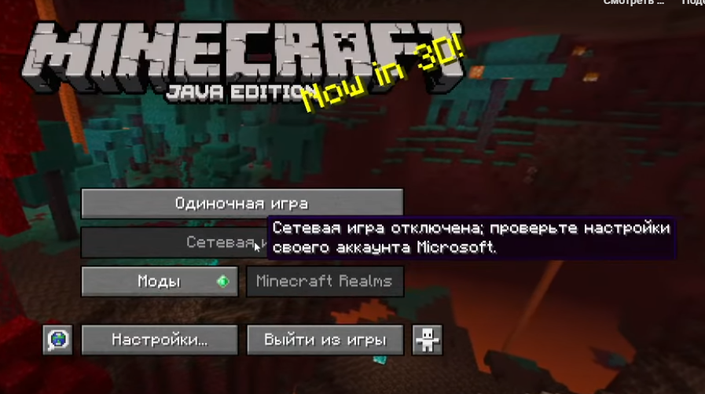

# Minecraft Multiplayer Fix

Скрипт для решения проблем с недоступностью сетевой игры в Minecraft, связанных с работой Microsoft Gaming Services или сбоями серверов авторизации.

## Описание проблемы
В некоторых случаях кнопка "Сетевая игра" в клиенте Minecraft становится неактивной. Часто это происходит из-за невозможности корректного обмена данными со службами авторизации Microsoft или региональных ограничений. Данный скрипт временно перенаправляет запросы к доменам Mojang на локальный адрес, что в ряде случаев позволяет обойти блокировку интерфейса мультиплеера.

## Возможности
* Автоматическое внесение необходимых записей в системный файл hosts.
* Проверка на наличие дубликатов перед записью (файл не замусоривается).
* Функция отката: скрипт позволяет одной командой удалить все внесенные изменения.
* Автоматическая очистка кэша DNS для мгновенного применения настроек.

## Использование
1. Скачайте файл `mc_fix.bat`.
2. Нажмите на него правой кнопкой мыши и выберите "Запуск от имени администратора". Это необходимо для редактирования системных файлов Windows.
3. Выберите нужный пункт в появившемся меню (1 — применить фикс, 2 — вернуть настройки по умолчанию).
4. Перезапустите игру.

## Важная информация
При использовании данного фикса авторизация на официальных лицензионных серверах (таких как Hypixel) может быть недоступна, так как клиент перестает связываться с реальными серверами проверки лицензии. Чтобы вернуть доступ к официальным серверам, воспользуйтесь функцией отката в меню скрипта.

---
Разработано для личного использования и распространяется "как есть".
